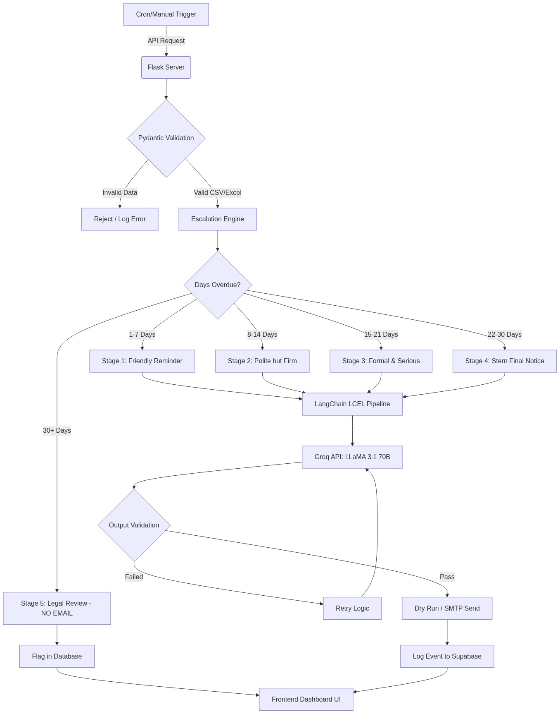

# Knot — Autonomous Finance AI Agent

## <span style="color:red">Live Demo Link:</span> [https://knot-finance-ai-eile.vercel.app/](https://knot-finance-ai-eile.vercel.app/)

    

Knot is an **autonomous, fail-safe credit collections platform** designed for enterprise finance teams. It dramatically reduces Days Sales Outstanding (DSO) by analyzing delinquent invoices, mapping them to intelligent escalation stages, and generating context-aware follow-ups without manual intervention.

---

## Table of Contents
- [Project Overview](#project-overview)
- [Agent Architecture Diagram](#agent-architecture-diagram)
- [Process Flow](#process-flow)
- [Tech Stack & Rationale](#tech-stack--rationale)
- [Security Mitigations](#security-mitigations)
- [Sample Outputs & Results](#sample-outputs--results)
- [Setup Instructions](#setup-instructions)
- [Future Works](#future-works)

---

## Project Overview
Finance teams spend hours chasing payments. Most follow-ups are inconsistent in tone, sent too late — or never sent at all. 

Knot acts as a digital collections agent. It scans a list of outstanding invoices, automatically detects which clients are overdue, maps the overdue days to a specific **Escalation Stage**, and triggers a large language model to write the perfect email. Everything is completely audit-logged, and the solution requires zero recurring cloud costs beyond standard hosting.

### Key Metrics Handled:
- **0% Failure Logic**: Gracefully handles LLM downtime and parsing errors without crashing.
- **Immutable Audit Trail**: Every action, legal flag, and AI generation is permanently logged to Supabase.
- **Board-Ready Reports**: Instant PDF, Word, and highly-formatted Excel exports.

---

## Agent Architecture Diagram



---

## Process Flow

1. **Upload Your Invoice Data**: Drop a CSV or Excel file via the UI or API. The agent validates every field using Pydantic.
2. **Auto-Detect Overdue Records**: The trigger engine calculates days overdue for every invoice and maps each record to its exact escalation stage.
3. **LLM Writes the Perfect Email**: The system generates a fully personalized, professional email. It applies the right tone, urgency, and ensures all six required fields are present.
4. **Send, Log & Escalate**: Emails are sent (or dry-run logged). 30+ day accounts are instantly flagged for legal review — no automated emails are sent at this stage.

---

## Tech Stack & Rationale

Every component was chosen for **zero operational cost** and **maximum production reliability**.

| Layer | Technology | Rationale |
| :--- | :--- | :--- |
| **Backend API** | Flask | Replaced previous Streamlit architecture with a headless REST API for true enterprise scalability and clear separation of concerns. |
| **LLM Inference** | Llama 3.1 70B (via Groq) | Blazing fast inference (~500 tokens/sec) on Groq's free tier. 70B parameters ensure top-tier nuance for legal/finance tones. |
| **Framework** | LangChain LCEL | Declarative orchestration of the prompting pipeline, allowing easy swaps to Mixtral or GPT-4o if required later. |
| **Database** | Supabase (PostgreSQL) | Native PG integration, built-in Row Level Security (RLS), and a generous free tier (500MB) for persistent audit trailing. |
| **Validation** | Pydantic v2 | Strict schema enforcement on inputs and outputs. Ensures the LLM never hallucinates critical fields like `amount_due`. |
| **Frontend** | HTML5, CSS3, JS | A bespoke "Warm Editorial Finance" SPA. Zero-dependency vanilla frontend for maximum performance and a premium aesthetic. |

---

## Security Mitigations

Finance data deserves the highest respect. Knot implements defense-in-depth:

- **Prompt Injection Defense**: Input sanitization strips injection patterns before data reaches the LLM.
- **PII Protection**: Client emails are masked in all logs. Supabase Row-Level Security (RLS) is enabled.
- **No Key Leaks**: All credentials are fed via `.env` (development) or Render environment variables (production).
- **Hallucination Guard**: Pydantic validates all 6 required fields (Name, Invoice No, Amount, Due Date, Overdue Days, Payment Link) are present in the LLM output. The email is blocked if any are missing.
- **Safe by Default**: `DRY_RUN_MODE=true` by default. No real emails are ever sent without explicit administrative opt-in.
- **Trigger Auth**: Automated endpoints reject unauthenticated `/run-agent` calls.

---

## Sample Outputs & Results

### Tone Examples by Stage

- **Stage 1 (Friendly, 1-7 days)**: *"Hi [Name], just a quick note that invoice [Inv] for [Amount] is slightly overdue. We know how busy things get, so we've included a quick payment link..."*
- **Stage 4 (Final Notice, 22-30 days)**: *"Dear [Name], despite multiple attempts, invoice [Inv] remains unpaid at [Overdue] days. Please remit [Amount] within 24 hours to prevent immediate escalation to our collections team..."*

### Dashboard Metrics
The native dashboard tracks:
* **Stage Distribution**: Visual breakdown of delinquency.
* **Recovery Rate**: Track the percentage of successful closures.
* **Value at Risk**: Real-time aggregation of outstanding capital.

---

## Setup Instructions

### Prerequisites
- Python 3.11+
- [Groq API Key](https://console.groq.com/keys)
- [Supabase Project](https://supabase.com/) (URL and Key)

### Local Deployment
1. **Clone the Repository**
   ```bash
   git clone https://github.com/LuciferMorningStar2605/Knot---Finance-AI.git
   cd Knot---Finance-AI
   ```

2. **Create a Virtual Environment**
   ```bash
   python -m venv venv
   source venv/bin/activate  # On Windows: venv\Scripts\activate
   ```

3. **Install Dependencies**
   ```bash
   pip install -r requirements.txt
   ```

4. **Configure Environment Variables**
   ```bash
   cp .env.example .env
   # Edit .env with your specific API keys and Database URL
   ```

5. **Initialize Database Tables (First Run)**
   ```bash
   python main.py --init-db
   ```

6. **Run the Flask Server**
   ```bash
   flask --app server run --port 5050
   # Access the dashboard at http://localhost:5050
   ```

---

## Future Works
1. **Multi-Channel Orchestration**: Add Twilio integration to automatically trigger SMS reminders for Stage 3 accounts.
2. **Payment Gateway Webhooks**: Integrate Stripe/Razorpay to automatically mark invoices as `RESOLVED` the moment a transaction clears.
3. **Conversational Negotiation Agent**: Upgrade the system from a static email-sender to an active LangGraph agent capable of negotiating payment plans and answering client queries over email threads.
